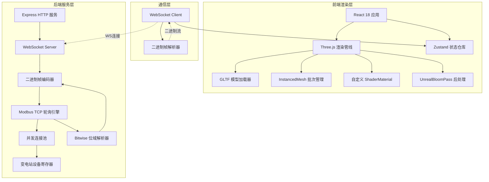
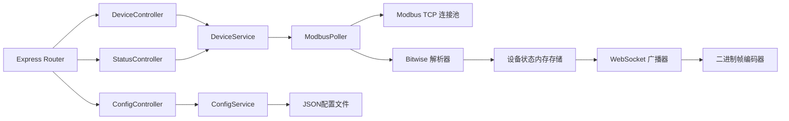
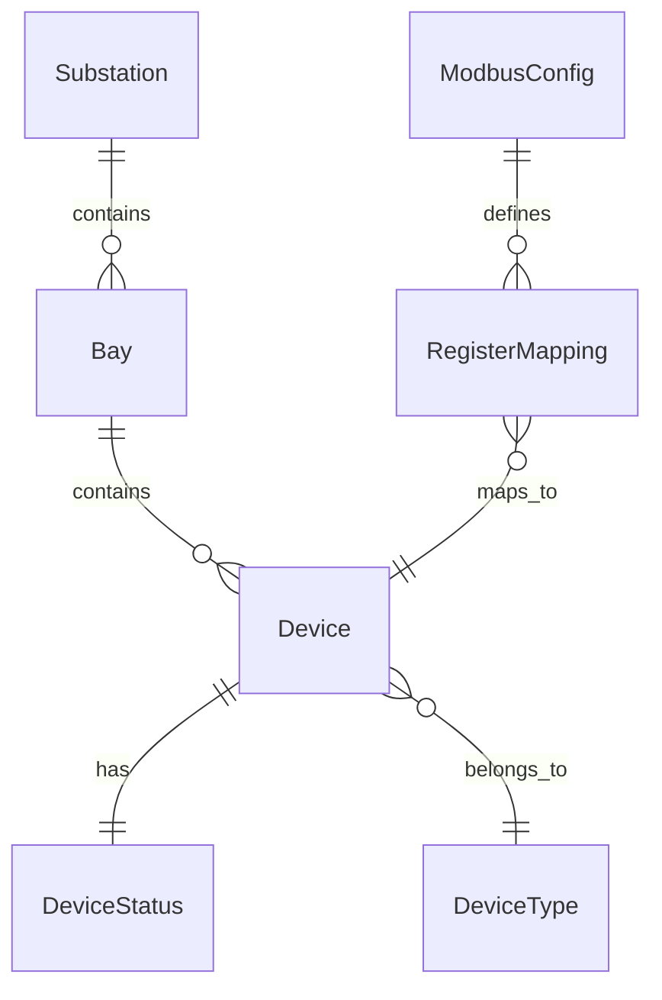

## 1. 架构设计



## 2. 技术说明

- **前端**：React@18 + Three.js + @react-three/fiber + @react-three/drei + @react-three/postprocessing + TailwindCSS@3 + Zustand + Vite
- **项目初始化工具**：vite-init (react-express-ts 模板)
- **后端**：Express@4 + modbus-serial (Modbus TCP) + ws (WebSocket)
- **数据库**：无外部数据库，设备配置通过 JSON 文件管理，运行时状态全部内存维护

## 3. 路由定义

| 路由 | 用途 |
|------|------|
| / | 数字孪生主控台——三维场景+设备状态面板+告警条 |
| /monitor | 设备监控面板——遥测数据表格+趋势曲线+状态卡片 |
| /config | 系统配置页——Modbus参数+推送配置 |

## 4. API 定义

### 4.1 WebSocket 接口

**连接地址**: `ws://<host>:<port>/ws/twin`

**二进制帧格式** (详见 PRD §5)：
- 全量快照帧 (FrameType=0x01)：启动时一次性推送全部设备状态
- 增量更新帧 (FrameType=0x02)：每轮询周期推送变化设备

### 4.2 HTTP REST 接口

| 方法 | 路径 | 描述 | 请求体 | 响应体 |
|------|------|------|--------|--------|
| GET | /api/devices | 获取全部设备列表 | - | `{ devices: Device[] }` |
| GET | /api/devices/:id | 获取单个设备详情 | - | `Device` |
| GET | /api/config/modbus | 获取Modbus配置 | - | `ModbusConfig` |
| PUT | /api/config/modbus | 更新Modbus配置 | `ModbusConfig` | `{ success: boolean }` |
| GET | /api/config/push | 获取推送配置 | - | `PushConfig` |
| PUT | /api/config/push | 更新推送配置 | `PushConfig` | `{ success: boolean }` |
| GET | /api/status | 获取系统运行状态 | - | `SystemStatus` |

### 4.3 TypeScript 类型定义

```typescript
interface Device {
  id: number;
  type: DeviceType;
  status: DeviceStatus;
  currentA: number;
  currentB: number;
  currentC: number;
  voltageA: number;
  voltageB: number;
  voltageC: number;
  lastUpdate: number;
}

enum DeviceType {
  Breaker = 0,
  Disconnector = 1,
  Transformer = 2,
}

interface DeviceStatus {
  isOpen: boolean;
  alarm: boolean;
  fault: boolean;
}

interface ModbusConfig {
  host: string;
  port: number;
  pollIntervalMs: number;
  slaveStart: number;
  slaveEnd: number;
  timeoutMs: number;
  registerMap: RegisterMapping[];
}

interface RegisterMapping {
  slaveId: number;
  registerBase: number;
  deviceType: DeviceType;
  deviceId: number;
}

interface PushConfig {
  wsPort: number;
  pushIntervalMs: number;
  maxConnections: number;
  binaryFormat: 'v1';
}

interface SystemStatus {
  modbusConnected: boolean;
  wsClientCount: number;
  pollCycleMs: number;
  lastPollTimestamp: number;
  deviceCount: number;
  uptime: number;
}
```

## 5. 服务端架构图



## 6. 数据模型

### 6.1 数据模型定义



### 6.2 设备配置数据 (JSON文件)

设备配置通过 `api/data/devices.json` 管理，结构如下：

```json
{
  "substation": {
    "id": "SS-500KV-001",
    "name": "500kV变电站",
    "bays": [
      {
        "id": "BAY-01",
        "name": "1号主变间隔",
        "devices": [
          {
            "id": 1001,
            "type": 0,
            "name": "断路器CB-5011",
            "slaveId": 1,
            "registerBase": 0,
            "position": [10, 0, 5]
          }
        ]
      }
    ]
  },
  "modbus": {
    "host": "127.0.0.1",
    "port": 502,
    "pollIntervalMs": 200,
    "slaveStart": 1,
    "slaveEnd": 128,
    "timeoutMs": 1000
  },
  "push": {
    "wsPort": 8081,
    "pushIntervalMs": 200,
    "maxConnections": 10
  }
}
```

## 7. 关键技术实现

### 7.1 Modbus TCP 并发轮询

- 使用 `modbus-serial` 库创建 TCP 连接池，并发读取多个从站
- 将从站地址范围分组，每组并行轮询，组内串行读取
- 每次读取 Holding Register (FC=0x03)，读取长度覆盖状态+电气量
- 轮询周期默认 200ms，通过配置可调

### 7.2 Bitwise 位域解析

- 读取的寄存器值按位拆解：
  - Bit0：断路器/隔离开关开合状态（0=合闸，1=分闸）
  - Bit1：告警标志
  - Bit2：故障标志
- 三相电流/电压值从后续寄存器读取，uint16 原值除以10得到实际值

### 7.3 二进制帧编码/解码

- 后端编码：Buffer 手动拼接，12字节/设备，支持全量快照与增量更新
- 前端解码：DataView 按偏移读取，零拷贝解析

### 7.4 InstancedMesh 渲染优化

- 绝缘子：共享 CylinderGeometry + MeshStandardMaterial，InstancedMesh 渲染数千实例
- 开关罩：共享 BoxGeometry + MeshStandardMaterial，InstancedMesh 渲染
- 每帧仅更新变化设备的 instanceMatrix，避免全量重设

### 7.5 Shader 刀闸旋转

- 自定义 ShaderMaterial，通过 uniform 数组传入设备开合状态
- Vertex Shader 中根据 instanceID 索引状态数组，动态旋转刀闸顶点
- 旋转轴为刀闸枢轴点，角度从 0°（合闸）到 90°（分闸）

### 7.6 UnrealBloomPass 辉光效果

- 使用 @react-three/postprocessing 的 Bloom 效果
- 仅对 emissive 强度>阈值的材质生效
- 带电区域通过 Shader 动态设置 emissiveIntensity，产生能量场辉光
